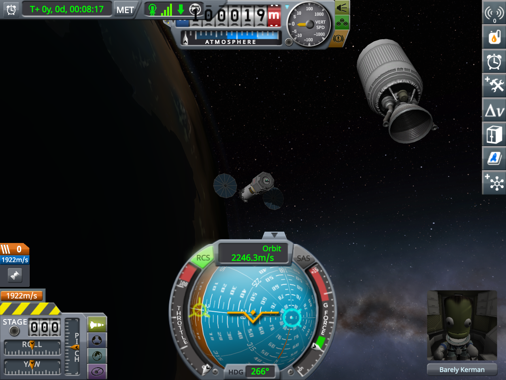
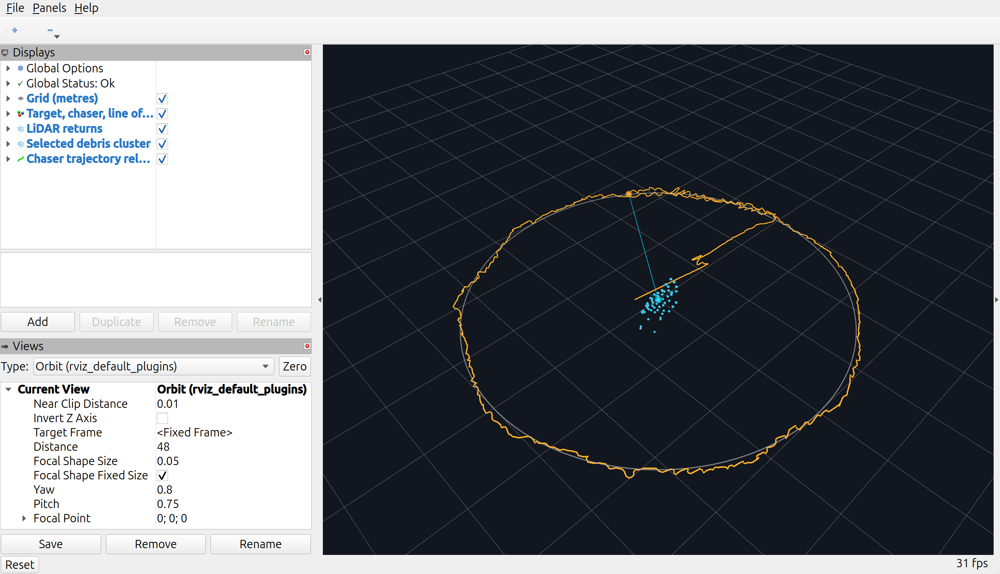
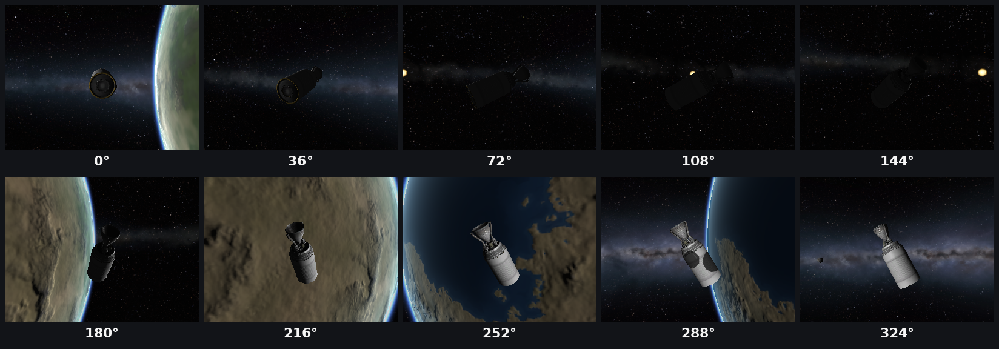

# 軌道上のデブリ周回・撮影

先に[共通準備](index.md)で本体とdemosをcloneしてください。コマンドはPyLoN本体のルートで実行します。

3D LiDARとIMUで近くのデブリとの相対運動を推定し、RCSで周回しながら機体カメラで撮影します。実際の周回試験で使用した機体を`.craft`として同梱しているので、VABで読み込んで準備します。



中央下の太陽電池を広げた機体が自機、右上のタンクとエンジンが撮影対象です。このページの画像は2026-09-07のKSP 1.12.5での実行記録です。

## 1. デモをインストールする

[Getting Started](../guide/getting-started.md)でMODとbridgeを導入した後、PyLoNリポジトリのルートで実行します。

```bash
source /opt/ros/jazzy/setup.bash
rosdep install --from-paths \
  Ros2/pylon_interfaces Ros2/pylon_bridge Ros2/pylon_vehicle_control \
  ../demos/pylon_demo_debris_orbit \
  --ignore-src --rosdistro jazzy -y
./sync.sh --skip-ksp-build --skip-ksp-sync --demo debris_orbit
source ~/ros2_ws/install/setup.bash
```

## 2. 同梱の機体をKSPで読み込む

機体ファイルはdemosリポジトリの[`pylon_demo_debris_orbit/craft/PyLoN Debris Orbiter.craft`](https://github.com/PyLoN-sim/demos/blob/main/pylon_demo_debris_orbit/craft/PyLoN%20Debris%20Orbiter.craft)です。試験機`test A`のパーツ配置とセンサー設定を引き継ぎ、旧MODの識別名を現行PyLoNへ変換しています。KSPのstockパーツとPyLoNが必要です。

KSPを終了してから、PyLoN本体のルートで次を実行します。`SAVE`を使用する既存のsandboxセーブのフォルダー名へ置き換えてください。既存の同名ファイルは上書きしません。

```bash
KSPDIR="$HOME/.local/share/Steam/steamapps/common/Kerbal Space Program"
SAVE='ROS2 debug'
cp -n '../demos/pylon_demo_debris_orbit/craft/PyLoN Debris Orbiter.craft' \
  "$KSPDIR/saves/$SAVE/Ships/VAB/"
```

KSPでそのセーブを開き、VABの機体読み込みから **PyLoN Debris Orbiter** を選びます。Mk1ランダー缶にクルーを1名乗せてください。

| 搭載済みのもの | 確認する設定・用途 |
|---|---|
| RCSブロック8個・モノプロペラントタンク | 周回中の並進・姿勢制御 |
| 太陽電池2枚 | 軌道上で展開して電源を確保 |
| 3D LiDAR | Sensor ID `front_lidar`、Long、250 m、10 Hz |
| RGBカメラ | Sensor ID `orbit_camera`、5 Hz、垂直画角60度 |
| デカプラーの先のX200-32タンク＋Mainsail | 分離して撮影対象にする |

### 軌道へ配置して対象を分離する

`.craft`に含まれるのは機体設計です。軌道上の位置・速度や分離状態は保存されていません。同梱機体は軌道上の周回試験用で、地上からの打ち上げ用ロケットとしては検証していません。

1. VABからFlightへ移り、KSP標準のデバッグメニューでKerbinの高度約100 kmの円軌道へ配置します。打ち上げから行う場合は、別途打ち上げ手段を用意してください。
2. エンジンを停止し、機体が安定してから、デカプラーの右クリックメニューでタンク・エンジンを分離します。保存済みのステージにはエンジンも含まれるため、ここではSpaceキーを使いません。
3. センサーを積んだ機体を操作対象にし、太陽電池を展開してRCSを有効にします。対象が推力を出しておらず、相対運動が小さい状態にします。
4. LiDARの測距範囲に対象を入れ、LiDAR・カメラと各UDP配信が有効であることを確認します。Sensor IDは同梱機体に設定済みです。

このデモは、近距離で共に自由落下する自機と対象を想定しています。周回半径の既定値は15 mです。機体とデブリの大きさに合わせ、衝突しない空間を確保してください。

元機体での周回・撮影記録はありますが、現行PyLoN名へ変換した同梱ファイルのKSP再読み込み・再飛行は未確認です。

## 3. bridgeを起動する

ターミナルAで実行します。bridgeはこの1プロセスを使います。

```bash
source /opt/ros/jazzy/setup.bash
source ~/ros2_ws/install/setup.bash
ros2 run pylon_bridge udp_bridge \
  --host 127.0.0.1 --port 49010 --disable-ground-truth
```

別ターミナルで入力を確認します。

```bash
source /opt/ros/jazzy/setup.bash
source ~/ros2_ws/install/setup.bash
ros2 topic echo --once /ksp_vessel/lifecycle
ros2 topic hz /ksp_vessel/lidar_3d/front_lidar/points
ros2 topic hz /ksp_vessel/imu/data_raw
ros2 topic hz /ksp_vessel/camera/orbit_camera/image_raw
```

`ros2 topic hz`は1つずつ実行し、確認したら`Ctrl-C`で終了します。機体状態がACTIVEで、点群・IMU・画像を受信できてから進みます。

## 4. 周回を開始する

ターミナルBで実行します。`enabled:=true`を指定すると機体の制御を開始します。

```bash
source /opt/ros/jazzy/setup.bash
source ~/ros2_ws/install/setup.bash
ros2 launch pylon_demo_debris_orbit pylon_demo_debris_orbit.launch.py \
  enabled:=true demo_instance_id:=orbit_a \
  lidar_sensor_id:=front_lidar camera_sensor_id:=orbit_camera \
  orbit_radius:=15.0 rviz:=true
```

対象を見つけるまでは機体を回して探索します。点群から3回続けて対象を取得すると、対象への指向・接近を始め、指定半径へ到達後に周回します。RVizでは点群、対象クラスタ、対象中心、自機、目標半径、軌跡を確認できます。



水色の点群が対象、灰色の円が目標半径、オレンジ色の線が自機の推定軌跡です。点群を捕捉できているか、軌跡が対象の周囲を回っているかを確認します。

推定と表示だけを試す場合は、上のコマンドの`enabled:=true`を`enabled:=false controller_enabled:=false`へ置き換えます。

## 5. 状態と撮影結果を確認する

```bash
ros2 topic echo /ksp_vessel/demos/debris_orbit/orbit_a/status
ros2 topic echo /ksp_vessel/demos/debris_orbit/orbit_a/estimator_status
ros2 topic echo /ksp_vessel/demos/debris_orbit/orbit_a/controller_status
```

`demo_instance_id`を変更した場合は、Topic内の`orbit_a`も置き換えます。

周回開始位置を0度とし、36度ごとにPNGと計測JSONを保存します。保存先はデモを起動したディレクトリからの相対パスで、`pylon_demo_debris_orbit_captures/orbit_a/<起動日時>/`です。既定では2周目以降も撮影を続けます。



搭載カメラの撮影例です。上段左から0〜144度、下段左から180〜324度で、対象を見る方向と背景のKerbinが変わります。この一覧は保存されたPNGを説明用に並べたもので、デモは個別のPNGとJSONを出力します。

画像の時刻と推定角度を照合し、指定角度を通過してから既定2度以内の画像を保存します。`capture_missed`の場合は画像配信の周期と遅延を確認してください。

## 停止と再開

デモのターミナルで`Ctrl-C`を押すと、制御指令をゼロにしてleaseを解放します。終了後にbridgeも`Ctrl-C`で停止できます。

機体切替、制御権喪失、入力欠測後は停止を保持します。IMUが0.5秒を超えて途切れた場合も、機体を安定させてからデモのlaunch全体を起動し直してください。

## 主な起動引数

| 引数 | この手順の値 | 用途 |
|---|---|---|
| `enabled` | `true` | 周回制御を開始 |
| `demo_instance_id` | `orbit_a` | Topicと撮影ディレクトリの識別名 |
| `lidar_sensor_id` / `camera_sensor_id` | `front_lidar` / `orbit_camera` | 搭載センサーのID |
| `orbit_radius` | `15.0` | 周回半径［m］ |
| `rviz` | `true` | RVizを起動 |
| `controller_enabled` | `true`（既定） | 共通制御器を起動 |
| `config_file` | パッケージ同梱YAML | 推定・誘導・撮影設定を変更 |

設定ファイルはリポジトリの`../demos/pylon_demo_debris_orbit/config/pylon_demo_debris_orbit.yaml`です。機体への指令と所有権は[機体制御API](../api/vehicle-control.md)、画像の設定は[RGBカメラ](../parts/camera.md)を参照してください。
