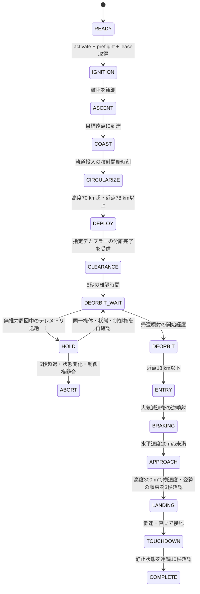

# 衛星分離・逆噴射着陸

専用の無人機 **PyLoN Phoenix** を打ち上げ、衛星を分離した後、回収機を逆噴射で着陸させるデモです。Space ROSのコンテナで動作し、ROS 2のmanaged lifecycle、期限付き制御権、ミッション状態機械、診断Topicを組み合わせます。

KSP 1.12.5とSpace ROSで、`hop`の打ち上げ・高度約1.5 kmでの分離・逆噴射・上空での横移動停止・自立着陸・完了判定まで実飛行を確認しています。尾翼付き機体でも約78.2 × 81.0 kmへの軌道投入と衛星分離を確認しました。周回軌道からの帰還は検証中で、発射場への精密帰還を保証するものではありません。

## 機体

`PyLoN Phoenix.craft`は、stockパーツ32個の単段式ロケットです。機体ファイルはリポジトリの`Demo/pylon_demo_reusable/craft/PyLoN Phoenix.craft`にあります。

| 系統 | 構成・意図 |
|---|---|
| 回収機の操縦装置 | RC-L01大型プローブをrootに配置。分離後も回収機をactive vesselに維持 |
| 推進系 | Mainsail 1基、X200-32タンク5本。液体燃料7,200 / 酸化剤8,800 unit |
| 姿勢制御 | リアクションホイール2基、Mainsailのジンバル、AV-R8可動尾翼4枚 |
| 着陸装置 | 幅広の支持梁4本とLT-2脚4本。降下終盤に展開 |
| 発射支持 | 発射クランプ4本。実測推力が機体重量を上回ってから順次解放 |
| 電源 | 回収機のRTG 2基を2.5 mサービスベイ内に収納。衛星のRTG 1基 |
| 衛星 | 小型スタックプローブ、ノーズコーン、RTG。専用デカプラー1個で分離 |

パラシュートや無限燃料は使いません。既存機体への誤操作を避けるため、起動条件は機体名`PyLoN Phoenix`、Kerbin上で接地中、エンジン1個・未分離デカプラー1個です。複数エンジンやフェアリングを追加する場合は、識別条件と誘導を変更してください。

KSPを終了してから、使用するセーブのVABへコピーします。既存ファイルは上書きしません。

```bash
KSPDIR="$HOME/.local/share/Steam/steamapps/common/Kerbal Space Program"
SAVE='ROS2 debug'  # 使用するsandboxセーブのフォルダー名
cp -n 'Demo/pylon_demo_reusable/craft/PyLoN Phoenix.craft' \
  "$KSPDIR/saves/$SAVE/Ships/VAB/"
```

VABでPhoenixを読み込み、LaunchPadへ出します。Spaceキーによる手動ステージ操作は不要です。

## ビルド・起動

MODを更新したらKSPを再起動してください。

```bash
./sync.sh --demo reusable
./spaceros.sh build
./spaceros.sh test
./spaceros.sh demo
```

`demo`はbridgeとmission nodeを起動し、missionを`inactive`までconfigureします。同じKSPへ接続する別のbridgeは、先に停止してください。

別ターミナルで準備状態を確認し、明示的にactivateすると打ち上げます。

```bash
./spaceros.sh exec ros2 lifecycle get /reusable_mission
./spaceros.sh exec ros2 topic echo --once /reusable_mission/status
./spaceros.sh exec ros2 lifecycle set /reusable_mission activate
./spaceros.sh exec ros2 topic echo /reusable_mission/events
```

statusの`preflight`が空文字であれば準備完了です。`waiting_for_flight_state`のままの場合は、新しいDLLがロードされているか、bridgeのGround Truthが有効か確認します。

ホストのROS 2 Jazzyでも同じデモを起動できます。

```bash
source /opt/ros/jazzy/setup.bash
source ~/ros2_ws/install/setup.bash
ros2 launch pylon_demo_reusable demo.launch.py
ros2 lifecycle set /reusable_mission activate
```

## ミッション状態



すべての実行状態から`ABORT`へ移れます。入力欠測、シミュレーション停止、予期しない機体・セッション変更、制御権喪失、燃料・電源不足、分離未確認、段階のタイムアウトで停止を保持します。停止時は推力・操舵をゼロにしleaseを解放します。空中でのabortは自動着陸を意味しません。

既定の`orbital`は遠点80 km・近点78 km以上への投入を確認してから衛星を分離します。分離指令の送信だけでは次へ進みません。意図した分離で飛行セッションが更新された場合は、同じ機体・同じKSPプロセスであることと分離完了を確認し、新しいleaseを取得して続行します。衛星との離隔時間を取ってから、回収機のみ帰還噴射を行います。機体を衛星へ切り替えるとabortします。

上昇時は高度2 kmまで直立し、その後に重力ターンを行います。動圧3 kPa超では指令迎角を3度以内に制限します。尾翼はstockのpitch/yaw/roll入力に連動し、帰還時も姿勢制御に使います。

帰還では大気抵抗で減速した後、逆噴射で水平速度を落とし、鉛直降下へ移ります。現在の誘導はシミュレーション真値に依存します。近傍の着陸目標は発射台の南約100 mの平地です。着陸前に高度300 m付近で降下を止め、横速度0.3 m/s未満・鉛直速度0.5 m/s未満・ほぼ直立を3秒確認してから最終降下します。最終降下中は横方向の位置合わせを行いません。着地点が指定緯度・経度の15 km以内なら位置補正を行いますが、遠方からの着地点予測や地形選択は実装していません。着水・転倒・高速接地は成功扱いにしません。

## 短時間の弾道飛行

姿勢・分離・着陸の確認には`hop`を選べます。

```bash
./spaceros.sh demo profile:=hop
```

同じactivate操作で約1,500 m上昇し、頂点付近で模擬衛星を分離して回収機を着陸させます。こちらは衛星を周回軌道へ投入しません。分離した模擬衛星も落下します。`COAST → DEPLOY → CLEARANCE → ENTRY → APPROACH → LANDING`と進み、軌道投入・帰還待機を省略します。

## Space ROSの状態管理

ノードの`unconfigured / inactive / active / finalized`は標準の[ROS 2 managed lifecycle](https://design.ros2.org/articles/node_lifecycle.html)です。Space ROS上でもこのインターフェースを使います。打ち上げなどのミッション段階は、その内側のアプリケーション状態機械として実装しています。Space ROS独自の認証や飛行適格性を示すものではありません。

| 機能 | このデモでの役割 |
|---|---|
| `configure` | 設定を検証して待機。機体を動かさない |
| `activate` | 新鮮な飛行状態・電源・燃料・対象機体を確認。制御権取得後に点火 |
| `deactivate` / `shutdown` | 指令をゼロにしてlease解放。自動再点火しない |
| `cleanup → configure` | 新しい試行を準備。再開時も地上でのpreflightが必要 |
| `/reusable_mission/events` | 遷移前後の状態、KSP時刻、理由の記録 |
| `/reusable_mission/status` | 現在の段階、制御権、分離確認、高度・速度・燃料 |
| `/diagnostics` | 正常状態またはabort理由を標準診断形式で通知 |

KSP側の制御権leaseは1秒、指令の有効期間は0.3秒です。ROS側では通常0.6秒の入力欠測で停止します。lease更新・分離は専用の送信タイミングを使い、別Topicの操舵・推力指令との順序競合を避けます。無推力の安定周回中は後述の`HOLD`を使います。それ以外では、KSPをポーズしてシミュレーション時刻が2秒間進まない場合も停止するため、再開で突然噴射しません。time warpは使用しないでください。

## 停止・再試行

```bash
./spaceros.sh exec ros2 lifecycle set /reusable_mission deactivate
# または
./spaceros.sh exec ros2 service call /reusable_mission/abort std_srvs/srv/Trigger '{}'
```

KSPで新しいPhoenixを発射台へ戻してから:

```bash
./spaceros.sh exec ros2 lifecycle set /reusable_mission deactivate
./spaceros.sh exec ros2 lifecycle set /reusable_mission cleanup
./spaceros.sh exec ros2 lifecycle set /reusable_mission configure
./spaceros.sh exec ros2 lifecycle set /reusable_mission activate
```

記録には、ホストのROS 2から次のTopicをrosbagへ保存できます。

```bash
ros2 bag record /reusable_mission/events /reusable_mission/status /diagnostics \
  /ksp_vessel/lifecycle /ksp_vessel/ground_truth/flight \
  /ksp_vessel/control/authority/state /ksp_vessel/actuators/separation/state
```

## 検証範囲

自動テストはpreflight、軌道到達前の分離抑止、分離確認・タイムアウト、通信断、ポーズ、機体変更、制御権喪失、停止後の再点火抑止、鉛直弾道モデルでの全段階と着地安定確認を対象にします。Space ROSイメージ内でも実行します。

独立した二次元の重力・空気抵抗モデルで軌道投入から帰還までの実行可能性を調べていますが、KSPの空力、加熱、燃料移動に伴う重心、実際の姿勢応答とは一致しません。軌道帰還を実証済みとは扱わないでください。

2026-09-21の実KSP `hop`試験では、最高対地高度1,524.5 m、接地直前の鉛直速度約-0.96 m/s・水平速度約0.04 m/sを記録しました。サスペンションの収束後、連続10秒の静止確認を経て`COMPLETE`へ移行し、leaseを解放した後も自立を維持しました。

### 無推力周回中の通信待機

`DEORBIT_WAIT`で高度・近点とも70 km以上、動圧ゼロの場合に限り、テレメトリ途絶時は`HOLD`へ移ります。出力をゼロにして制御権を解放し、最大5秒だけ待機します。同じ飛行セッションで燃料・質量が変わらず、新鮮な状態が0.5秒継続したら新しいleaseで復帰します。他の操縦者による制御権取得、機体変更、状態変化、期限超過はabortします。燃焼中と大気圏内ではこの復帰処理を使いません。
