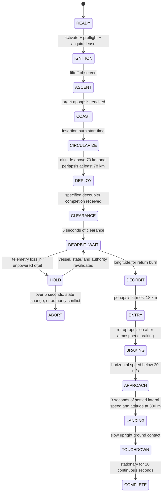

# Satellite Separation and Retropropulsive Landing {#衛星分離・逆噴射着陸}

First clone core and demos through [Shared Preparation](index.md). Run commands from the PyLoN core root.

Launch the dedicated uncrewed **PyLoN Phoenix**, separate a satellite, and land the recovery vehicle retropropulsively. This demo runs in Space ROS containers, combining ROS 2 managed lifecycle, expiring authority, a mission state machine, and diagnostic topics.

KSP 1.12.5 and Space ROS real-flight tests covered `hop` launch, separation around 1.5 km, retropropulsion, stopping horizontal motion aloft, upright landing, and completion. A fin-equipped vessel also achieved about 78.2 × 81.0 km orbit and satellite separation. Return from orbit is under validation; precision return to the launch site is not guaranteed.

## Vessel {#機体}

`PyLoN Phoenix.craft` is a single-stage rocket with 32 stock parts, at `../demos/pylon_demo_reusable/craft/PyLoN Phoenix.craft`.

| System | Configuration / intent |
|---|---|
| Recovery controls | RC-L01 large probe as root, keeping recovery vehicle active after separation |
| Propulsion | One Mainsail, five X200-32 tanks; 7,200 Liquid Fuel / 8,800 Oxidizer units |
| Attitude control | Two reaction wheels, Mainsail gimbal, four AV-R8 movable fins |
| Landing gear | Four broad support beams and four LT-2 legs, deployed late in descent |
| Launch supports | Four launch clamps, released sequentially after measured thrust exceeds weight |
| Power | Two recovery RTGs in a 2.5 m service bay; one satellite RTG |
| Satellite | Small stack probe, nose cone, RTG; separated with one dedicated decoupler |

No parachutes or infinite fuel are used. To avoid operating the wrong vessel, startup requires vessel name `PyLoN Phoenix`, grounded on Kerbin, one engine, and one unseparated decoupler. Adjust identification and guidance if adding engines or fairings.

Exit KSP, then copy into the chosen save's VAB. Existing files are not overwritten.

```bash
KSPDIR="$HOME/.local/share/Steam/steamapps/common/Kerbal Space Program"
SAVE='ROS2 debug'  # Sandbox save directory name
cp -n '../demos/pylon_demo_reusable/craft/PyLoN Phoenix.craft' \
  "$KSPDIR/saves/$SAVE/Ships/VAB/"
```

Load Phoenix in the VAB and move to the LaunchPad. Manual staging with Space is unnecessary.

## Build and start {#ビルド・起動}

Restart KSP after updating the mod.

```bash
./sync.sh --demo reusable
../demos/pylon_demo_reusable/spaceros.sh build
../demos/pylon_demo_reusable/spaceros.sh test
../demos/pylon_demo_reusable/spaceros.sh demo
```

`demo` starts the bridge and mission node, configuring the mission to `inactive`. Stop any other bridge connected to the same KSP first.

Inspect readiness in another terminal, then explicitly activate to launch.

```bash
../demos/pylon_demo_reusable/spaceros.sh exec ros2 lifecycle get /reusable_mission
../demos/pylon_demo_reusable/spaceros.sh exec ros2 topic echo --once /reusable_mission/status
../demos/pylon_demo_reusable/spaceros.sh exec ros2 lifecycle set /reusable_mission activate
../demos/pylon_demo_reusable/spaceros.sh exec ros2 topic echo /reusable_mission/events
```

An empty status `preflight` means ready. If it remains `waiting_for_flight_state`, check the loaded DLL and bridge Ground Truth setting.

The same demo also runs in host ROS 2 Jazzy.

```bash
source /opt/ros/jazzy/setup.bash
source ~/ros2_ws/install/setup.bash
ros2 launch pylon_demo_reusable demo.launch.py
ros2 lifecycle set /reusable_mission activate
```

## Mission states {#ミッション状態}



Every execution state can enter `ABORT`. Missing input, stopped simulation, unexpected vessel/session changes, authority loss, insufficient fuel/power, unconfirmed separation, and phase timeout hold stopped state. Stopping zeros thrust/steering and releases the lease. An airborne abort does not imply automatic landing.

Default `orbital` verifies insertion at 80 km apoapsis and at least 78 km periapsis before satellite separation. Merely sending a separation command does not advance the mission. If intended separation changes the Flight session, it verifies the same vessel/KSP process and separation completion, then acquires a fresh lease. After satellite clearance, only the recovery vehicle burns for return. Switching to the satellite aborts.

Ascent remains upright to 2 km before a gravity turn. Above 3 kPa dynamic pressure, commanded angle of attack is limited to 3°. Fins follow stock pitch/yaw/roll and assist return attitude control.

Return uses atmospheric drag, then retropropulsion to reduce horizontal speed and transition to vertical descent. Current guidance depends on simulator Ground Truth. The nearby landing target is flat ground about 100 m south of the pad. Around 300 m altitude, descent stops until horizontal speed is below 0.3 m/s, vertical speed below 0.5 m/s, and attitude nearly upright for three seconds. Final descent performs no lateral position alignment. Position correction is applied within 15 km of requested latitude/longitude; distant landing prediction and terrain selection are not implemented. Splashdown, tipping, and high-speed contact are not success.

## Short ballistic flight {#短時間の弾道飛行}

Select `hop` to test attitude, separation, and landing.

```bash
../demos/pylon_demo_reusable/spaceros.sh demo profile:=hop
```

The same activation ascends about 1,500 m, separates a simulated satellite near the apex, and lands the recovery vehicle. It does not place the satellite in orbit; the separated payload also falls. States follow `COAST → DEPLOY → CLEARANCE → ENTRY → APPROACH → LANDING`, skipping insertion and deorbit waiting.

## Space ROS state management {#space-rosの状態管理}

Node states `unconfigured / inactive / active / finalized` use standard [ROS 2 managed lifecycle](https://design.ros2.org/articles/node_lifecycle.html), also used on Space ROS. Mission phases such as launch form an application state machine within it. This does not indicate Space ROS-specific certification or flight qualification.

| Feature | Role in this demo |
|---|---|
| `configure` | Validate configuration and wait without moving the vessel |
| `activate` | Check fresh flight state, power, fuel, and target; acquire authority before ignition |
| `deactivate` / `shutdown` | Zero commands and release lease; no automatic reignition |
| `cleanup → configure` | Prepare a new attempt; ground preflight is required again |
| `/reusable_mission/events` | Record before/after states, KSP time, and transition reasons |
| `/reusable_mission/status` | Current phase, authority, separation confirmation, altitude, speed, fuel |
| `/diagnostics` | Report normal state or abort reasons as standard diagnostics |

KSP authority leases last one second; command validity is 0.3 seconds. ROS normally stops after 0.6 seconds without input. Lease renewal, attitude, thrust, and separation are ordered through one `ControlBatch` path without a dedicated heartbeat tick. Observations use same-frame `ControlSnapshot`. Separation checks retained results by `operation_id` against post-separation identity and queries lost results through the service. `SimulatorState` distinguishes pause, warp, communication gaps, and stalled UT. Stable unpowered orbit uses `HOLD` below; other pause/warp states abort to prevent reignition.

## Stopping and retrying {#停止・再試行}

```bash
../demos/pylon_demo_reusable/spaceros.sh exec ros2 lifecycle set /reusable_mission deactivate
# Or
../demos/pylon_demo_reusable/spaceros.sh exec ros2 service call /reusable_mission/abort std_srvs/srv/Trigger '{}'
```

After placing a new Phoenix on the pad in KSP:

```bash
../demos/pylon_demo_reusable/spaceros.sh exec ros2 lifecycle set /reusable_mission deactivate
../demos/pylon_demo_reusable/spaceros.sh exec ros2 lifecycle set /reusable_mission cleanup
../demos/pylon_demo_reusable/spaceros.sh exec ros2 lifecycle set /reusable_mission configure
../demos/pylon_demo_reusable/spaceros.sh exec ros2 lifecycle set /reusable_mission activate
```

Record these topics with rosbag from host ROS 2.

```bash
ros2 bag record /reusable_mission/events /reusable_mission/status /diagnostics \
  /ksp_vessel/lifecycle /ksp_vessel/control/snapshot /ksp_vessel/simulator/state \
  /ksp_vessel/control/authority/state /ksp_vessel/actuators/separation/result
```

## Validation scope {#検証範囲}

Automated tests cover preflight, suppression of separation before reaching orbit, separation confirmation/timeouts, communication loss, pause, vessel changes, authority loss, suppression of reignition after stopping, all phases in a vertical ballistic model, and stable touchdown. Tests also run in the Space ROS image.

An independent 2D gravity/drag model explores feasibility from insertion through return, but does not match KSP aerodynamics, heating, fuel-driven CoM changes, or actual attitude response. Do not treat this as demonstrated orbital return.

The 2026-09-21 real-KSP `hop` test recorded maximum AGL 1,524.5 m, pre-contact vertical speed about -0.96 m/s, and horizontal speed about 0.04 m/s. After suspension settled and ten continuous stationary seconds, it entered `COMPLETE` and stayed upright after lease release.

### Waiting for communication in unpowered orbit {#無推力周回中の通信待機}

Only in `DEORBIT_WAIT`, with altitude/periapsis at least 70 km and zero dynamic pressure, telemetry loss enters `HOLD`. Outputs are zeroed and authority released. Communication loss waits at most five seconds; explicit pause waits up to 300 seconds. Loss of communication during pause still has the five-second limit. Shared checkpoint validation requires the same Flight session, configuration/resources/mass/orbit within tolerances, zero thrust, no pending operations, and fresh state. After 0.5 seconds of stability, it resumes with a fresh lease. Another controller's acquisition, vessel/state changes, or expired waiting time abort. This recovery is not used during burns or in the atmosphere.

After this API migration, automated tests verified communication ordering, pause recovery, and result queries. Flight records above predate migration. Orbital return, warp, and quicksave-load resume on the new API remain unvalidated in real flight; automatic resume across epochs is not implemented.
